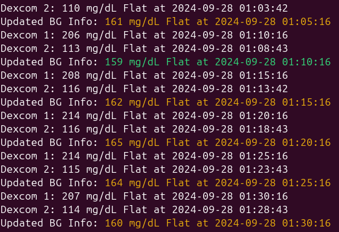
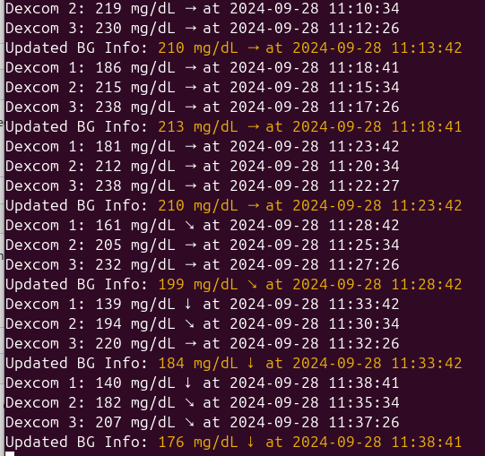

# ikizCom,  Dexcom Dual Monitor, Twin İkiz






** ikizCom - Dexcom Dual Monitor** is a Python-based tool for monitoring blood glucose levels from two Dexcom CGM (Continuous Glucose Monitoring) devices. It fetches data from both devices, logs the values, timestamps, and trend directions, and calculates the average blood glucose if both sources provide valid data. The results are saved in a temporary file and printed to the terminal.


Dexcom 1 : Samsung Galaxy Note10+, Dexcom App,  812CXX Transmitter 06.09.24, Sensor 9117 07.09.24  
Dexcom 2 : Samsung Galaxy Note10+, xDrip App,   87TRXX Transmitter Original Battery 30.06.24, Sensor 9317 17.09.24  
Dexcom 3 : Iphone 15 Pro Max,       Dexcom App, 87FUXX Transmitter Original Battery 28.09.24, Sensor 9311 28.09.24  

## Features

- Monitors two Dexcom devices simultaneously.
- Displays the blood glucose (BG) value, trend direction, and the timestamp of the reading.
- Calculates and logs the average blood glucose if both devices provide data.
- Automatically updates the values every 5 minutes and handles errors.
- Writes formatted BG data to `/tmp/bg_info.txt` for further usage.

## Requirements

- Python 3.x
- [pydexcom](https://pypi.org/project/pydexcom/)
- Dexcom CGM devices with valid login credentials.

### Installation

1. Clone the repository:

```bash
git clone https://github.com/faymaz/ikizCom.git
cd ikizCom
```

2. Install the required Python package:

```bash
pip install pydexcom
```

3. Modify the script with your Dexcom login credentials:

```python
dexcom1 = Dexcom(username="your_email_or_phone_1", password="your_password_1", ous=True)
dexcom2 = Dexcom(username="your_email_or_phone_2", password="your_password_2", ous=True)
```

If you are outside the USA:
```python
dexcom = Dexcom(username="your_email_or_phone", password="your_password", ous=True)
```

If you are in the USA:
```python
dexcom = Dexcom(username="your_email_or_phone", password="your_password")
```


4. Run the script:

```bash
python ikizCom.py &
```

## Usage

The script will automatically start fetching the blood glucose data from the two Dexcom devices. It will display the following information in the terminal:

- **Blood glucose (mg/dL)**: The glucose level measured by the device.
- **Trend arrow**: The current trend of the blood glucose (rising, falling, or stable).
- **Timestamp**: The time when the glucose reading was recorded.

If data is available from both devices, the average glucose value will be calculated and displayed. The data is also written to the `/tmp/bg_info.txt` file.

## Example Output

```
Dexcom 1: 194 mg/dL ↑ at 2024-09-28 00:40:16
Dexcom 2: 111 mg/dL → at 2024-09-28 00:43:42
Updated BG Info: 152 mg/dL ↑ at 2024-09-28 00:40:16
```

## Error Handling

The script includes basic error handling:
- If one device does not provide data, the other device's data will still be used.
- If neither device provides data, it will retry after 1 minute.
- Any errors encountered during data retrieval will be printed to the terminal.

## License

This project is licensed under the MIT License - see the LICENSE file for details.

## Contributing

Contributions are welcome! Please open an issue or submit a pull request for any enhancements or bug fixes.

## Contact

For any issues or questions, please contact `faymaz@gmail.com`.
```
